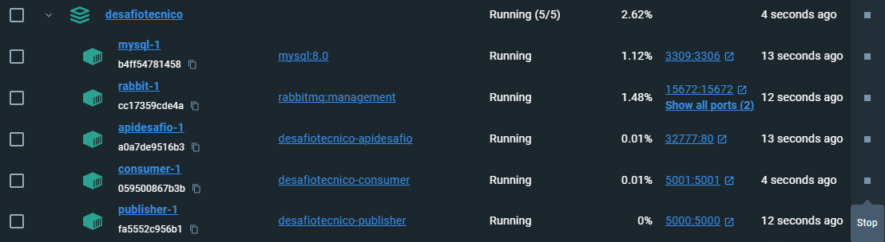
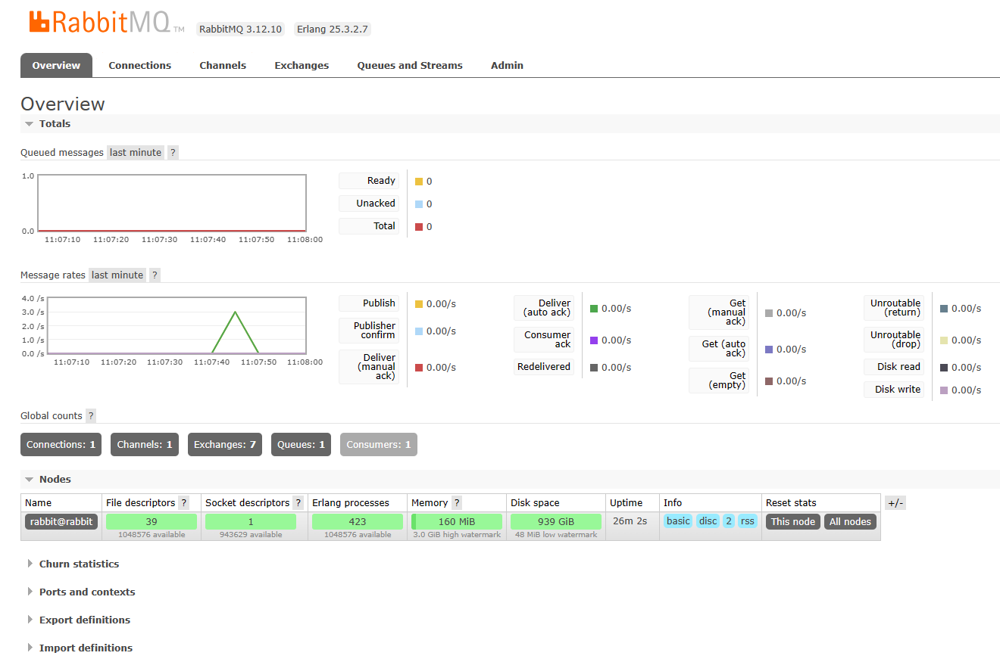
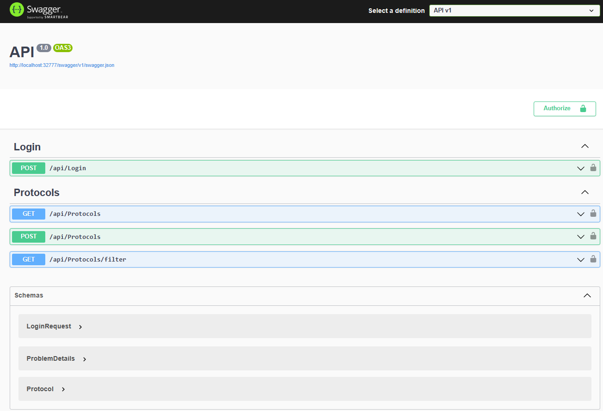
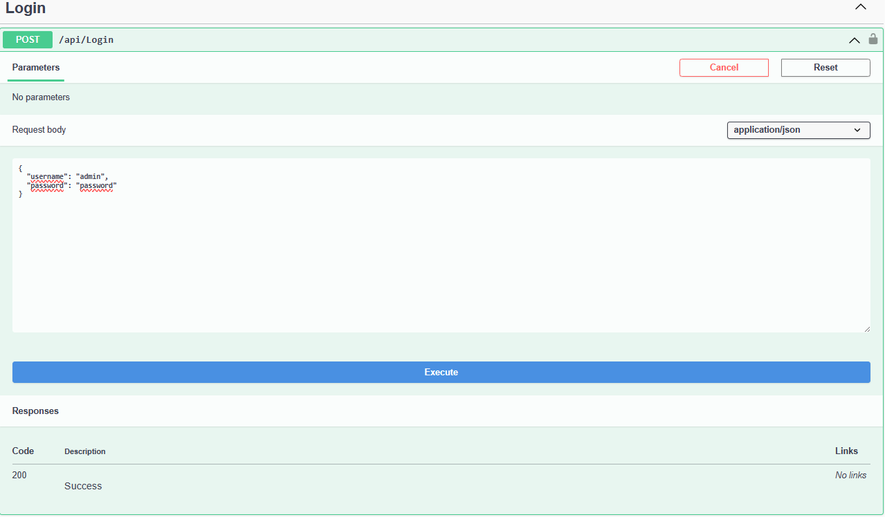
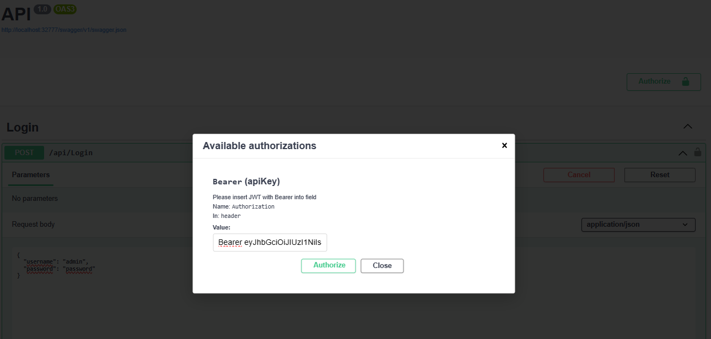

# Cadastro de Protocolos
###         _Solicitação de Emissão de Documentos_
## Funcionalidades
O sistema permite a realização de cadastro e consulta de protocolos para solicitação de emissão de documentos, conforme podemos identificar abaixo:
- GET/ api/Protocols;
- POST/ api/Protocols;
- GET/ api/Protocols/filter;

Entretanto, para utilizar essas funcionalidades é necessário utilizar um token, que será gerado por um dos endpoints da aplicação, disponível no swagger, conforme será explicado melhor a seguir.

Após a aplicação estar rodando corretamente no conteiner Docker todoas as funcionalidades poderão ser acessadas através do endereço: http://localhost:32777/swagger/index.html

## Executando e utilizando a sua aplicação

Esta aplicação foi criada utilizando-se do NetCore 6.0, RabbitMQ e MySQL, rodando em conteiner no Docker, para tanto, é necessário que o docker esteja configurado na sua máquina, para tanto, sugiro a instalação da versão mais atual do [Docker](https://www.docker.com/products/docker-desktop/). Com a instalação concluída e o Docker devidamente funcional, segue o passo a passo para utilização da aplicação:

- Clone o projeto diretamente através do Visual Studio utilizando do código https://github.com/sabrinafrosseto/desafiotecnico.git ou acessando o [repositório do projeto](https://github.com/sabrinafrosseto/desafiotecnico) e realizando a clonagem do projeto pelo método que melhor lhe convier.
- Com o projeto devidamente clonado, execute no terminal, dentro do pasta do projeto, o comando: docker-compose up --build
- Com isso, o projeto começará a rodar no Docker, com uma imagem similar a esta:

- Caso alguns dos conteiners não esteja como "Running, clique no final de 'play' para executar o conteiner.

#### Criando base de dados
A fim de garantir a existência de uma base de dados com informações foi criada uma funcionalidade que cria alguns protocolos automaticamente, assim, após estar com todos os conteineres rodando adequadamente, o ideal é executar novamente o publisher, para tanto, clique no botão de 'stop' do conteiner 'Publisher' e clique novamente no 'play'. Desta forma, o Publisher rodará as suas funcionalidades e publicará algumas mensagens para a fila do RabbitMQ. As mensagens estarão na fila e poderão ser vistas consultando: http://localhost:15672/ e logando com os dados:
- usuário: guest
- senha guest
Você terá visão de uma tela similar esta abaixo, onde é possível ver a chegada de uma mensagem:

Após esta etapa será necessário parar e rodar o conteiner do Consumer, realizando o mesmo procedimento anterior, mas, agora no conteiner '*consumer*'. Ao fazer isso ele lerá as mensagens contidas nas filas do rabbitMQ e procederá com a criação de novos objetos 'protocolo' no banco de dados.

#### Consultando os dados gerados
A fim de permitir a consulta dos protocolos existe a API, com uma interface simples de uso, chamada Swagger, através do qual é possível utilizar as funcionalidades expostas da API.
Para tanto, acesse a [API](http://localhost:32777/swagger/index.html) e você terá acesso a dois tipos de consulta e uma opção de cadastro, conforme pode ser visto na imagem abaixo:

Nesta página do Swagger você pode clicar em cada um dos métodos para utilizá-lo, conforme será explicado a seguir.

Por questões de segurança, entretanto, antes de utilizar os métodos é necessário gerar um TOKEN, através de um login e senha. Para tanto, você utilizará o método POST/ api/Login e enviará como dados de login e senha os dados a seguir:
- usuario: admin
- senha: password
*Obs: Por ora, o login é único, entretanto, será trazida melhoria que garantirá o registro de novos usuários, devidamente cadastrados em um banco de dados, para geração de token individual.
Conforme segue na imagem a seguir:

Ao executar este método o usuário receberá um Bearer Token que ele deverá copiar e inserir na área de Authorize no topo da página, à direita. Ali ele inserirá este token com a palavra 'Bearer' na frente, conforme exemplo a seguir, e clicando em 'Authorize':

Agora sim, o usuário está autorizado a utilizar as funcionalidades da API de protocolos.

Seguem algumas informações sobre os métodos disponíveis:

- GET /api/Protocols
Através deste método é possível consultar todos os protocolos cadastrados.

- GET /api/Protocols/filter
Através deste método é possível consultar protocolos específicos utilizando como filtro os campos protocolNumber(Número do Protocolo), RG ou CPF, conforme a preferência do usuário, sendo obrigatória a utilização de apenas um deles.

- POST /api/Protocols
Através deste método é possível cadastrar um novo protocolo, preenchendo os campos da requisição, conforme modelo abaixo, onde o usuário substituirá onde está escrito *string* pelo dado correspondente, mantendo as aspas:
{
  "numeroProtocolo": "string",
  "numeroViaDocumento": "string",
  "cpf": "string",
  "rg": "string",
  "nomeCompleto": "string",
  "nomeMae": "string",
  "nomePai": "string",
  "foto": "string",
  "ID": "string"
}
E assim, o usuário terá rodado a aplicação e utilizado as funcionalidades disponíveis.

Com essas funcionalidades a aplicação atende seus requisitos mínimos e encontra-se disponível para utilização. Novas funcionalidades serão incluídas com o tempo e podem trazer oportunidades de novos negócios.